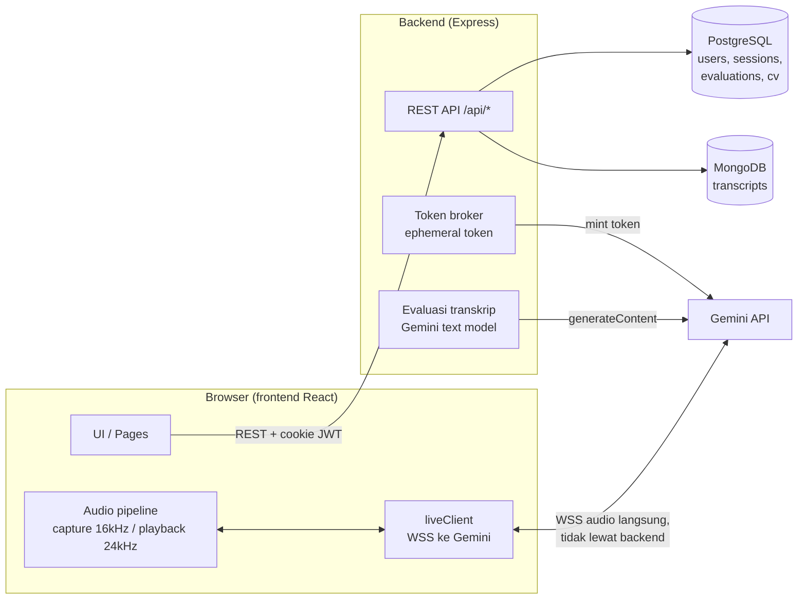

# Arsitektur InterviewAI

Dokumen ini menjelaskan arsitektur teknis InterviewAI: aplikasi web simulasi wawancara kerja berbasis suara real-time dengan pewawancara AI (Gemini Live API), untuk pencari kerja Indonesia. Dokumen acuan lain: [`PRD.md`](./PRD.md) dan [`IMPLEMENTATION_PLAN.md`](./IMPLEMENTATION_PLAN.md).

## Gambaran Umum



Tiga keputusan arsitektur kunci:

1. **Token-broker pattern** — API key Gemini yang berumur panjang hanya ada di backend. Browser meminta *ephemeral token* sekali pakai (umur 30 menit) ke backend, lalu membuka koneksi WSS **langsung ke Gemini**. Audio real-time tidak pernah melewati server kita.
2. **Konfigurasi sesi dikunci server-side** — model, system instruction (persona pewawancara), voice, temperature, dan modality dikunci lewat `liveConnectConstraints` saat mencetak token. Klien hanya boleh mengirim `sessionResumption` (untuk reconnect), tidak bisa mengubah persona.
3. **Dua database sesuai bentuk data** — PostgreSQL untuk data relasional (user, sesi, evaluasi, CV), MongoDB untuk transkrip percakapan (dokumen dengan array `exchanges` yang bentuknya fleksibel).

## Tech Stack

| Lapisan  | Teknologi |
| -------- | --------- |
| Frontend | React + Vite + TypeScript + Tailwind CSS v4 |
| Backend  | Node.js + Express + TypeScript (ESM) |
| Database | PostgreSQL (relasional) + MongoDB (transkrip) |
| AI live  | Gemini Live API via `@google/genai` (`GEMINI_MODEL`, default `gemini-3.1-flash-live-preview`, audio native, `v1alpha`) |
| AI evaluasi | Gemini text model (`GEMINI_ANALYSIS_MODEL`, default `gemini-2.5-flash`) dengan structured JSON output |
| Auth     | JWT (access + refresh) + argon2 |

Monorepo npm workspaces: `frontend/` dan `backend/`. Saat dev, Vite (port 5180) mem-proxy `/api/*` ke backend (port 4000) sehingga panggilan API same-origin.

## Backend (`backend/src`)

Struktur modular per domain — tiap modul punya `routes → controller → service` (+ `schema` Zod untuk validasi input):

```
config/        env.ts (validasi env via Zod, fail-fast), db.ts (pool PG), mongo.ts (client + koleksi transcripts)
db/            migrate.ts + migrations/*.sql (dijalankan via `npm run migrate -w backend`)
middleware/    requireAuth (JWT), rateLimit (auth & gemini limiter), errorHandler (AppError terpusat)
modules/
  auth/        register, login, refresh, logout, me
  jobFields/   daftar bidang pekerjaan (data seed)
  sessions/    CRUD sesi + token + analyze + end
  cv/          upload CV (PDF/DOCX) + ekstraksi teks
  gemini/      token broker + prompt builder + evaluasi
utils/         asyncHandler, jwt, password (argon2)
```

Boot sequence (`server.ts`): validasi env → `connectMongo()` (fail-fast dengan `serverSelectionTimeoutMS` 4 detik dan pesan hint jika Mongo tidak jalan) → baru `app.listen()`. Helmet, CORS (origin dari env, `credentials: true`), dan `trust proxy` (untuk nginx di produksi) dipasang global.

### Endpoint API

| Endpoint | Keterangan |
| --- | --- |
| `POST /api/auth/register`, `/login` | Rate-limited (`authLimiter`); password di-hash argon2 |
| `POST /api/auth/refresh`, `/logout`; `GET /api/auth/me` | Refresh token via cookie httpOnly |
| `GET /api/job-fields` | Daftar bidang pekerjaan (publik hasil seed) |
| `POST /api/sessions` | Buat sesi (job field, judul posisi, perusahaan, deskripsi, CV opsional) |
| `GET /api/sessions`, `GET /api/sessions/:id` | Riwayat + detail (selalu dicek kepemilikan `user_id`) |
| `POST /api/sessions/:id/token` | **Token broker** — mint ephemeral token Gemini (`geminiLimiter`) |
| `POST /api/sessions/:id/analyze` | Kirim transkrip ke Gemini text model, hasilkan evaluasi (`geminiLimiter`) |
| `POST /api/sessions/:id/end` | Tutup sesi: tulis transkrip ke Mongo lalu update Postgres |
| `DELETE /api/sessions/:id` | Hapus sesi |
| `POST /api/cv`, `GET /api/cv/:id` | Upload CV (multer) + ekstraksi teks (pdf-parse / mammoth) |

Semua route sessions dan cv dilindungi `requireAuth`; parameter `:id` divalidasi UUID lewat middleware sebelum menyentuh DB.

### Modul Gemini (`modules/gemini/gemini.service.ts`)

Dua tanggung jawab:

1. **Ephemeral token** — `createEphemeralToken()` memanggil `ai.authTokens.create` dengan `uses: 1`, umur 30 menit, dan `liveConnectConstraints` yang mengunci model + system instruction + voice (`Kore`, `id-ID`) + temperature + modality audio + transkripsi input/output. `lockAdditionalFields: []` penting: tanpa itu SEMUA field terkunci dan `sessionResumption` dari klien akan diabaikan diam-diam, sehingga reconnect selalu membuka sesi kosong baru.
2. **Evaluasi** — `generateEvaluation()` menyusun prompt dari transkrip, meminta JSON terstruktur (`responseSchema`) dengan 4 metrik tetap (Komunikasi, Relevansi, Struktur/STAR, Kepercayaan Diri), lalu `normalizeEvaluation()` memvalidasi longgar via Zod dan menormalkan hasil (clamp skor 0–100, fallback jika model drift) sehingga bentuk `Evaluation` selalu konsisten untuk UI.

System instruction (persona pewawancara HR Indonesia) dibangun dari konteks sesi (bidang, posisi, perusahaan, deskripsi) plus teks CV kandidat (dipotong maksimal 8.000 karakter) — dan tidak pernah dikirim ke klien.

## Frontend (`frontend/src`)

```
pages/       Landing, Login, Dashboard (konfigurasi sesi), Session (wawancara live),
             Result, History, HistoryDetail
features/
  auth/      AuthContext + ProtectedRoute (semua halaman selain Landing/Login diproteksi)
  session/   Komponen sesi live: QuestionCard, TranscriptPanel, MicControl,
             AudioVisualizer, ConnectionPill, ReconnectOverlay, dst.
components/  Design system kecil: Button, Card, Input, Navbar, ScoreBadge, MetricBar, ...
lib/
  api.ts     Helper fetch REST (kredensial cookie)
  audio/     capture.ts (mic → PCM 16kHz via AudioWorklet), playback.ts (antrian PCM 24kHz),
             pcm.ts (konversi)
  gemini/    liveClient.ts — wrapper Live API, bebas React
hooks/       useLocalSpeechDetection (deteksi bicara lokal dari AnalyserNode)
```

Routing (React Router): `/` → `/login` → `/dashboard` → `/session/:id` → `/result/:id`, plus `/history` dan `/history/:id`.

### Pipeline audio sesi live

1. **Capture**: `getUserMedia` → `AudioContext` 16 kHz → AudioWorklet (`public/audio-worklet/pcm-capture-worklet.js`) → PCM 16-bit base64 → `liveClient.sendAudio()`. Audio **terus dikirim tanpa henti termasuk saat hening** — VAD server-side Gemini butuh aliran kontinu; menggerbang audio berdasarkan deteksi lokal terbukti membuat AI tidak pernah menjawab.
2. **liveClient** (`lib/gemini/liveClient.ts`): mint token dari backend → buka WSS langsung ke Gemini → memetakan pesan server ke handler kecil (`onInputTranscript`, `onOutputTranscript`, `onAudioChunk`, `onTurnComplete`, `onInterrupted`, `onError`). Reconnect otomatis saat koneksi putus tak terduga (maks 3 percobaan, backoff eksponensial ter-cap 4 detik) memakai **session resumption handle** agar percakapan berlanjut, bukan mulai dari nol; tersedia juga retry manual ("Coba sekarang"). Kickoff prompt teks memicu AI menyapa dan langsung bertanya.
3. **Playback**: chunk PCM 24 kHz dari Gemini di-enqueue ke `AudioPlayback`; event `interrupted` (barge-in, kandidat memotong) mengosongkan antrian.
4. **Liveness UI**: transkripsi input Gemini lag ~2,5–3,5 detik, jadi indikator "sedang bicara" memakai `useLocalSpeechDetection` — RMS dari `AnalyserNode` mic dengan hysteresis dan noise-floor adaptif. Sinyal ini **hanya untuk UI** (badge, visualizer, anchor giliran transkrip), tidak pernah menggerbang pengiriman audio.

### Alur satu sesi wawancara

1. Dashboard: user memilih bidang pekerjaan, mengisi posisi/perusahaan/deskripsi, opsional upload CV → `POST /api/sessions` → redirect ke `/session/:id`.
2. Halaman Session: `POST /api/sessions/:id/token` → koneksi WSS langsung ke Gemini → percakapan suara dua arah; transkrip (delta ASR diatribusikan ke giliran saat diucapkan) dikumpulkan di state klien.
3. Selesai: `POST /api/sessions/:id/analyze` (evaluasi dari transkrip) dan `POST /api/sessions/:id/end` — backend menulis transkrip ke Mongo **lebih dulu**, baru menandai sesi `completed` di Postgres (urutan Mongo→Postgres agar tidak ada sesi "completed" tanpa transkrip).
4. Halaman Result menampilkan skor keseluruhan, 4 metrik, strengths/improvements, dan ringkasan; History membaca daftar sesi dari Postgres.

## Model Data

**PostgreSQL** (migrasi SQL berurutan di `backend/src/db/migrations/`):

| Tabel | Isi |
| --- | --- |
| `users` | Akun (email, hash argon2) |
| `job_fields` | Bidang pekerjaan (di-seed migrasi 005) |
| `interview_sessions` | Sesi: `user_id`, `job_field_id`, `cv_id?`, judul/perusahaan/deskripsi, `status` (`in_progress`/`completed`), durasi, timestamps |
| `evaluations` | Hasil evaluasi per sesi: `overall_score`, `feedback_text`, `metrics` (JSON), strengths, improvements, summary |
| `cv_documents` | Metadata CV upload + teks hasil ekstraksi |

**MongoDB** — koleksi `transcripts`: `{ session_id, user_id, exchanges: [{ role: 'ai'|'user', text, timestamp? }], summary?, created_at }`. `session_id` menjadi join key ke `interview_sessions.id` di Postgres.

## Keamanan

- **API key Gemini tidak pernah menyentuh browser** — hanya ephemeral token sekali pakai; token dan API key tidak pernah di-log.
- Persona/model/voice dikunci server-side; klien hanya bisa mengirim resumption handle.
- JWT access token pendek (15 menit) + refresh token (7 hari) di cookie httpOnly; password argon2.
- Rate limiting terpisah untuk endpoint auth dan endpoint yang memicu panggilan Gemini (token/analyze).
- Semua query Postgres terparameterisasi; setiap akses sesi/CV memverifikasi kepemilikan `user_id`; param UUID divalidasi sebelum query.
- Helmet + CORS ketat (origin tunggal dari env); env divalidasi Zod saat boot (fail-fast).

## Konfigurasi (env backend)

Lihat `.env.example`. Kelompok utama: `PORT`/`CORS_ORIGIN`, secret JWT + TTL, koneksi PostgreSQL (`PG_*`), `MONGODB_URI` (wajib), `GEMINI_API_KEY` (wajib) + `GEMINI_MODEL` + `GEMINI_ANALYSIS_MODEL`, dan `CV_MAX_SIZE_MB`/`CV_STORAGE_PATH`. Validasi di `config/env.ts` menghentikan proses jika ada yang tidak valid.

## Deployment (rencana Fase 7)

Target VPS 2 GB di belakang nginx (`trust proxy` sudah diaktifkan; pool PG dibatasi `max: 10`), MongoDB pindah ke Atlas. Artefak deploy akan berada di `deploy/`.
